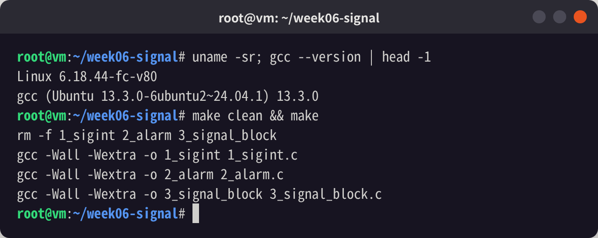
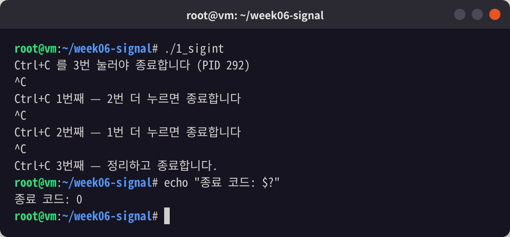
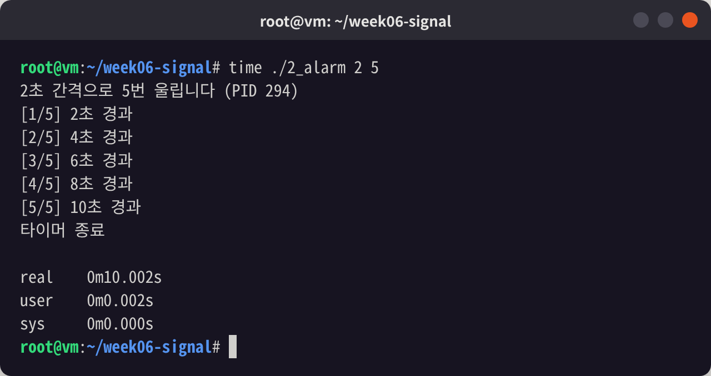
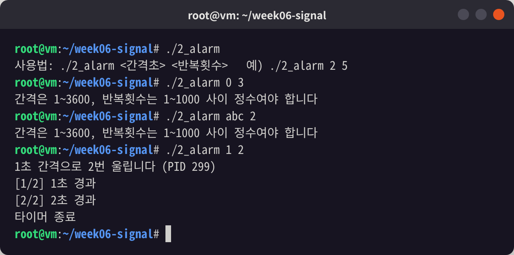
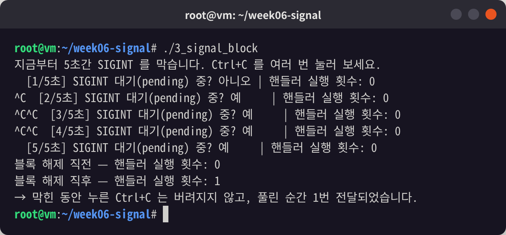

# 시스템프로그래밍 6주차 — 시그널 처리

시그널 핸들러를 등록하고(`sigaction`), 타이머를 만들고(`alarm`), 시그널을 잠깐 막아 보는(`sigprocmask`) 실습 과제입니다.
강의 예제 `1_sigint.c`, `2_alarm.c`, `3_signal_block.c` 를 과제 요구사항에 맞게 변형했습니다.

- 이름 / 학번: 이도현 / 23138703

## 목차
1. [파일 구성](#파일-구성)
2. [빌드](#빌드)
3. [과제 1. Ctrl+C 를 세 번 눌러야 종료](#과제-1-ctrlc-를-세-번-눌러야-종료-1_sigintc)
4. [과제 2. 타이머 만들기](#과제-2-타이머-만들기-2_alarmc)
5. [과제 3. 시그널 막아 보기](#과제-3-시그널-막아-보기-3_signal_blockc)
6. [공통으로 지킨 규칙](#공통으로-지킨-규칙)
7. [AI 사용 내역](#ai-사용-내역)

## 파일 구성

| 파일 | 내용 |
|---|---|
| `1_sigint.c` | Ctrl+C 를 세 번 눌러야 종료 |
| `2_alarm.c` | `./2_alarm <간격초> <반복횟수>` — N초마다 울리는 반복 타이머 |
| `3_signal_block.c` | SIGINT 를 5초간 막았다가 풀고, 대기 중이던 시그널이 전달되는지 확인 |
| `Makefile` | `gcc -Wall -Wextra` 로 세 프로그램 빌드 |
| `screenshots/` | 실행 화면 캡쳐 |

## 빌드

```bash
make          # 세 프로그램을 모두 빌드
make clean    # 실행 파일 삭제
```

`-Wall -Wextra` 로 컴파일했을 때 경고가 하나도 나오지 않습니다.



---

## 과제 1. Ctrl+C 를 세 번 눌러야 종료 (`1_sigint.c`)

### 요구사항
누른 횟수를 세어 세 번째에 정리 메시지를 내고 끝낸다. 핸들러에서는 카운터만 건드리고(`volatile sig_atomic_t`), `printf` 는 `main` 에서 한다.

### 구현
원본은 0/1 플래그(`got_sigint`)였는데, 이를 **카운터**로 바꿨습니다.

```c
static volatile sig_atomic_t sigint_count = 0;

static void handler(int sig)
{
    (void)sig;
    sigint_count++;   /* 카운터만 올린다 */
}
```

`main` 은 `pause()` 로 잠들어 있다가 시그널로 깨어날 때마다 카운터를 확인합니다.

```c
int shown = 0;                              /* main 이 지금까지 출력한 횟수 */
while (shown < NEED_PRESSES) {
    pause();
    while (shown < sigint_count && shown < NEED_PRESSES) {
        shown++;
        if (shown < NEED_PRESSES)
            printf("\nCtrl+C %d번째 — %d번 더 누르면 종료합니다\n", shown, NEED_PRESSES - shown);
    }
}
printf("\nCtrl+C %d번째 — 정리하고 종료합니다.\n", NEED_PRESSES);
```

- 안쪽 `while` 을 둔 이유: Ctrl+C 를 아주 빠르게 연타하면 `main` 이 한 번 깨어나는 사이에 카운터가 두 칸 이상 올라가 있을 수 있습니다. 이때도 1번째·2번째 메시지를 빠짐없이 출력하기 위해서입니다.
- `sigint_count++` 는 읽기·쓰기 두 단계라 원자적이지 않지만, 핸들러가 실행되는 동안 SIGINT 는 커널이 자동으로 블록하므로 핸들러끼리 겹쳐 실행되지 않고, `main` 은 읽기만 하므로 문제가 없습니다.

### 실행 화면
Ctrl+C 를 1초 간격으로 세 번 눌렀습니다. 터미널에 찍힌 `^C` 는 Ctrl+C 를 누른 흔적입니다.



- 첫 번째·두 번째 Ctrl+C 에서는 종료되지 않고 남은 횟수를 알려 줍니다.
- 세 번째에 정리 메시지를 출력하고 **정상 종료(종료 코드 0)** 합니다. 핸들러가 없었다면 SIGINT 기본 동작으로 죽어 종료 코드가 130(128+2)이었을 것입니다.

---

## 과제 2. 타이머 만들기 (`2_alarm.c`)

### 요구사항
`./alarm <간격초> <반복횟수>` 형태로 실행한다. `alarm` 은 한 번만 울리므로 핸들러가 처리한 뒤 다시 `alarm(간격)` 을 걸어야 반복된다.

### 구현
핸들러와 공유하는 값은 모두 `volatile sig_atomic_t` 로 선언했습니다.

```c
static volatile sig_atomic_t interval_sec = 0;   /* 알람 간격(초) */
static volatile sig_atomic_t remaining = 0;      /* 앞으로 울려야 할 횟수 */

static void on_alarm(int sig)
{
    (void)sig;
    remaining--;
    if (remaining > 0)
        alarm((unsigned int)interval_sec);   /* 다음 알람을 다시 예약 */
}
```

- `alarm` 은 `man 7 signal-safety` 의 async-signal-safe 목록에 있는 함수라 핸들러 안에서 불러도 됩니다.
- 남은 횟수가 0이 되면 더 이상 예약하지 않으므로, 쓸데없는 SIGALRM 이 남지 않습니다.
- `main` 은 `pause()` 로 기다리다가 "울린 횟수 = 전체 − 남은 횟수" 만큼 `[n/전체] n×간격초 경과` 를 출력합니다.
- 인자 검사: 인자 개수가 틀리면 사용법을 출력하고, `strtol` 로 숫자가 아니거나 범위(간격 1~3600, 횟수 1~1000)를 벗어난 값을 거릅니다.

### 실행 화면
`./2_alarm 2 5` — 2초 간격으로 5번 울립니다. `time` 으로 재 보니 전체 실행 시간이 **10.002초**(2초 × 5회)로, 간격이 정확히 지켜졌습니다.



잘못된 인자를 넣었을 때와 다른 간격(`1 2`)으로 실행했을 때입니다.



---

## 과제 3. 시그널 막아 보기 (`3_signal_block.c`)

### 요구사항
`sigprocmask(SIG_BLOCK, ...)` → 작업 → `SIG_SETMASK` 로 복원. 막힌 구간에서 Ctrl+C 를 누르고, 풀어 줄 때 전달되는지 확인해 적는다.

### 구현
원본에 두 가지를 추가했습니다.

1. **핸들러 실행 횟수(`delivered`)를 센다** — 여러 번 눌렀을 때 몇 번 전달되는지 확인하기 위해
2. **막힌 5초를 1초씩 나눠 매초 `sigpending` 으로 대기 상태를 출력한다** — 핸들러는 아직 안 돌았어도 시그널이 이미 "와 있는지" 확인하기 위해

```c
sigprocmask(SIG_BLOCK, &block, &old);          /* SIGINT 막기, 원래 마스크는 old 에 저장 */

for (int i = 1; i <= BLOCK_SEC; i++) {
    sleep(1);
    sigpending(&pending);                      /* 지금 대기 중인 시그널 집합 */
    printf("  [%d/%d초] SIGINT 대기(pending) 중? %s | 핸들러 실행 횟수: %d\n",
           i, BLOCK_SEC, sigismember(&pending, SIGINT) ? "예    " : "아니오", (int)delivered);
}

sigprocmask(SIG_SETMASK, &old, NULL);          /* 원래 마스크로 복원 → 대기 중이던 SIGINT 전달 */
```

풀 때 `SIG_UNBLOCK` 대신 `SIG_SETMASK` 로 이전 마스크를 복원했습니다. `SIG_UNBLOCK` 은 원래부터 막혀 있던 시그널까지 풀어 버릴 수 있기 때문입니다.

### 실행 화면
막혀 있는 동안(약 1.6초~3.6초 사이) Ctrl+C 를 **5번** 눌렀습니다. `^C` 가 5개 찍혀 있습니다.



### 관찰 결과
| 시점 | `sigpending` 결과 | 핸들러 실행 횟수 | 해석 |
|---|---|---|---|
| 1초 (아직 안 누름) | 아니오 | 0 | 아무 시그널도 오지 않음 |
| 2~5초 (5번 누름) | **예** | **0** | 시그널은 도착했지만 막혀 있어 **대기(pending)** 상태. 핸들러는 실행되지 않음 |
| 블록 해제 직전 | — | 0 | 여전히 전달되지 않음 |
| 블록 해제 직후 | — | **1** | 막기를 풀자마자 대기 중이던 SIGINT 가 **한 번** 전달됨 |

정리하면 다음과 같습니다.

1. **막힌 동안의 시그널은 버려지지 않는다.** 커널에 pending 상태로 남아 있다가, `sigprocmask(SIG_SETMASK, ...)` 로 풀어 주는 순간 전달되어 핸들러가 실행됐습니다. POSIX 는 `sigprocmask` 호출 후 대기 중인 시그널이 있으면 그중 하나 이상을 `sigprocmask` 가 리턴하기 전에 전달한다고 규정합니다. 그래서 "해제 직후" 출력에서 이미 횟수가 1로 보입니다.
2. **5번 눌렀는데 1번만 전달됐다.** pending 은 시그널마다 "왔다/안 왔다" 1비트뿐이라 큐에 쌓이지 않습니다. 따라서 시그널로 "몇 번 일어났는지" 를 셀 수는 없습니다. SIGCHLD 핸들러에서 `waitpid` 를 반복 호출해야 하는 이유도 이것입니다.
3. 막혀 있는 동안 Ctrl+C 를 눌러도 `sleep(1)` 이 중간에 깨지지 않았습니다. 시그널이 전달되지 않았으니 시스템 호출이 중단될 일도 없기 때문입니다.

---

## 공통으로 지킨 규칙

| 규칙 | 적용 |
|---|---|
| 핸들러 등록은 `signal()` 이 아니라 `sigaction()` | 세 프로그램 모두 `sigaction` 사용. `signal()` 은 구현마다 동작(핸들러 유지·재시작 여부)이 달라 이식성이 없음 |
| 공유 변수는 `volatile sig_atomic_t` | `sigint_count`, `interval_sec`, `remaining`, `delivered` |
| 핸들러 안에서는 async-signal-safe 함수만 | 핸들러는 변수 증감과 `alarm()` 만 사용. `printf` 는 전부 `main` 에서 |
| `sa_mask` 초기화 | `sigemptyset(&sa.sa_mask)` 로 반드시 초기화 |
| `gcc -Wall -Wextra` 경고 0개 | [빌드 화면](#빌드) 참고 |

---

## AI 사용 내역

### 사용한 도구
- Claude (Anthropic)

### 사용한 프롬프트
** 진행 방법 질문**
```
시그널 핸들러를 등록하고, 타이머를 만들고, 시그널을 잠깐 막아 본다.

1. Ctrl+C 를 세 번 눌러야 종료 — 1_sigint.c 를 변형. 누른 횟수를 세어 세 번째에 정리 메시지를 내고 끝낸다.
핸들러에서는 플래그(카운터)만 건드린다. 타입은 volatile sig_atomic_t. printf 는 main 에서 한다.

2. 타이머 만들기 — 2_alarm.c 를 변형. ./alarm <간격초> <반복횟수> 예) ./alarm 2 5
alarm 은 한 번만 울리므로, 핸들러가 처리한 뒤 다시 alarm(간격) 을 걸어야 반복된다.

3. 시그널 막아 보기 — 3_signal_block.c 를 변형. 막힌 구간에서 Ctrl+C 를 누르고, 풀어 줄 때 전달되는지 확인해 적는다.
sigprocmask(SIG_BLOCK, ...) → 작업 → SIG_SETMASK 로 복원. 막힌 동안의 시그널은 버려지지 않고 대기한다.

### AI 가 만든 것
- 세 C 파일의 변형 코드 초안, `Makefile`, `.gitignore`
- 이 README 초안
- AI 가 작업 중 스스로 고친 것: `3_signal_block.c` 에서 `%-6s` 로 칸을 맞췄더니, 한글은 바이트 수(글자당 3바이트)와 화면 폭(글자당 2칸)이 달라 `|` 위치가 어긋났습니다. 그래서 `"예    "` / `"아니오"` 처럼 화면 폭을 직접 맞춘 문자열로 바꿨습니다.

### AI 결과물과 본인이 고친 부분

| 파일 | AI 가 제시한 것 | 내가 고친 것 / 이유 |

| `2_alarm.c` | `pause()` 로 다음 알람을 기다림 | week06 강의자료에 따르면 pause()는 CPU를 쓰지 않아 좋지만, 새 알람이 왔는지 확인하는 것과
pause()로 잠드는 것 사이에 틈이 있어, 그 틈에 마지막 알람이 오면 핸들러가 이미 처리해 버려서
pause()를 깨울 시그널이 없고 프로그램이 영원히 멈춘다. 바쁜 대기를 넣어 실험해 보니 [원본 결과].
그래서 확인하는 동안 SIGALRM을 막아 두고, 잠들 때 sigsuspend()로 막기 해제와 잠들기를 한 번에
하도록 바꿨고, 같은 실험에서 [수정본 결과]. (CPU를 안 쓰는 장점은 그대로 유지) |

| `3_signal_block.c` | 막혀 있는 동안의 동작만 출력 | AI 코드는 막혀 있을 때만 보여 줘서 막혀 있지 않은 평소 상태와 비교할 수가 없었다.
그래서 블록을 푼 뒤 3초 동안 Ctrl+C 를 받는 코드를 추가했다.
막혀 있을 때는 Ctrl+C 를 눌러도 sleep 이 깨어나지 않고 끝까지 잤고, 핸들러 횟수는 [0] 이었다.
풀린 뒤에는 누르자마자 횟수가 [1] → [2] 가 되고, sleep 이 [2]초 남기고 깨어났다.
→ 비교해 보니 블록은 시그널을 버리는 게 아니라 미루는 것이라는 것을 확인했다.
  막혀 있으면 대기했다가 풀릴 때 전달되고, 막혀 있지 않으면 즉시 전달되어 핸들러가 실행되고 sleep 도 깨운다. |


## 참고 자료
- `man 2 sigaction`, `man 2 alarm`, `man 2 sigprocmask`, `man 2 sigpending`, `man 7 signal-safety`
- 시스템프로그래밍 6주차 강의 자료 (시그널 처리)
